# Motors
Trabalho Laravel/Breeze de um site para venda de carros

_Aluno: *Lucas Alexandre Pires Munhoz*_
_R.A: *020124002*_

## Requisitos para sua execução.

  1. Instalação do PHP
     [php](https://www.php.net/downloads.php)
  3. Instalação do Composer
     [composer](https://getcomposer.org/download/)
  6. Instalação do Node.js
     [node](https://nodejs.org/pt/download)
   ]

## Realizando criação do servidor.

  1. Abra o terminal no local que deseja que o projeto fique armazena e execute os seguites comando já ordenados:
      - Criação do projeto Laravel:
        * `composer create-project laravel/laravel Motors`
        * `cd Motors`
        
      - Instalação da extensão Laravel/Breeze:
        * `composer require laravel/breeze --dev`
        * `php artisan breeze:install blade`
        
      - Instalação do Node
        * `npm install`

  3. Execução do servidor:
     *Execute o comando para subir e carregar o banco com os dados para testar
       _Se preferir, executar os INSERTs do arquivo insert_
       *`php artisan migrate --seed`
     
     *Deixe 2 terminal executando os seguintes comando:*
     
        * `php artisan serve`
        * `npm run dev`
    
  5. Substituir as seguintes Pastas e Arquivos para para que o site seja executado:
      _Os arquivos necessarios para a instalação esta na pasta Motors_
     
      * App
      * Resouces
      * Routes
      * Database
      * Public
      * .env

    
## Fotos do Site funcioando:
* menu
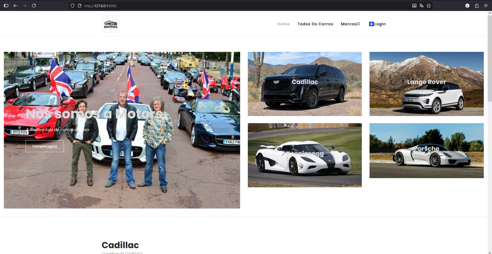
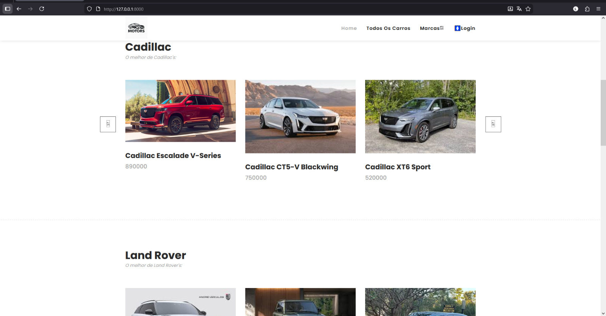
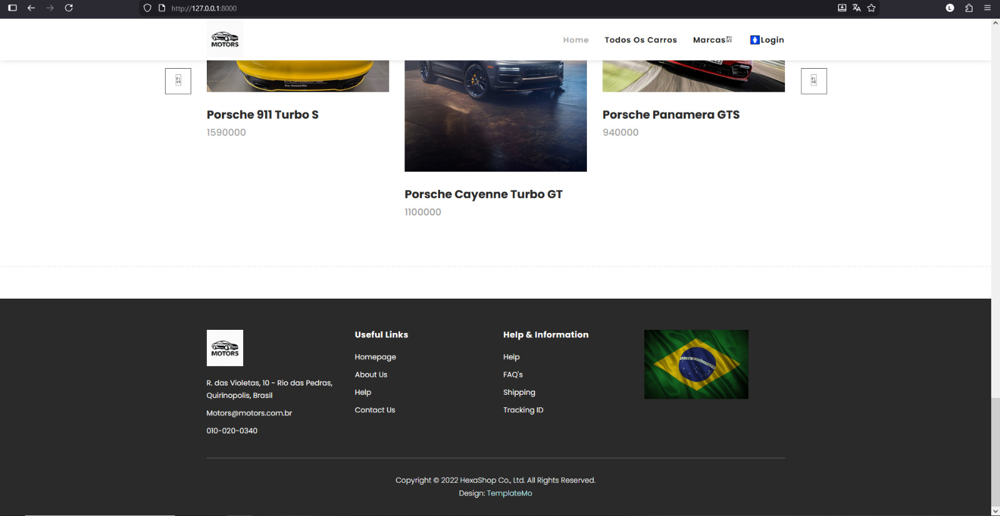
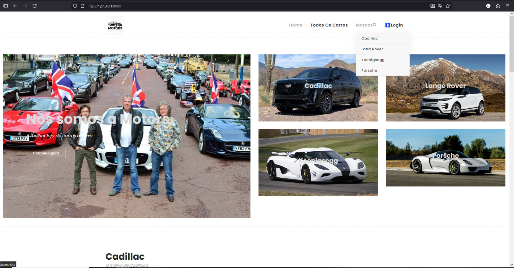

* Tela de compra de um produto
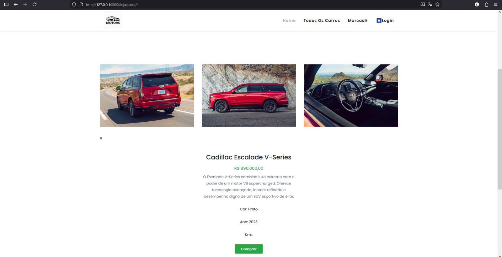

* Filtro por marca
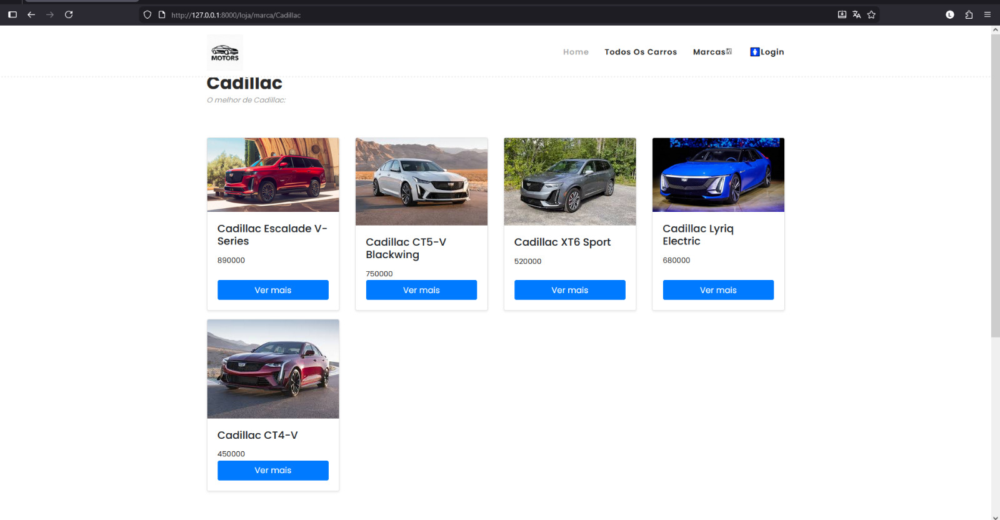

* Tela de Login
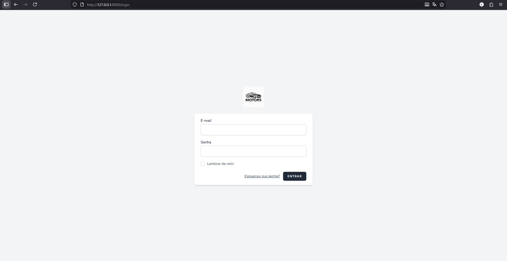

* Tela de enviou de e-mail para recuperação de senha
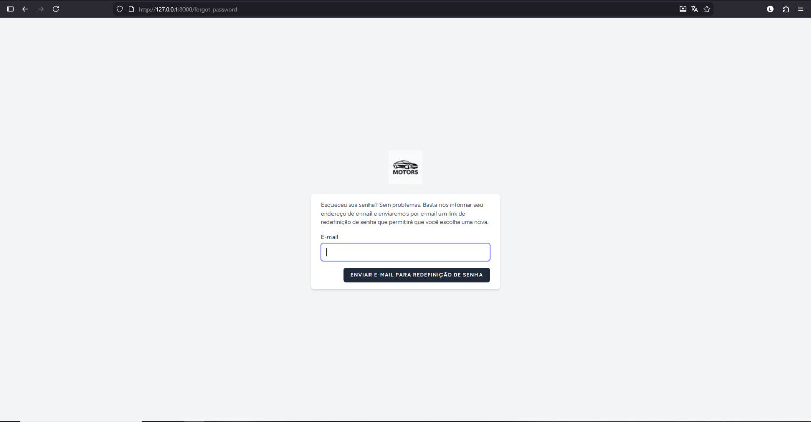

* Tela de cadastro
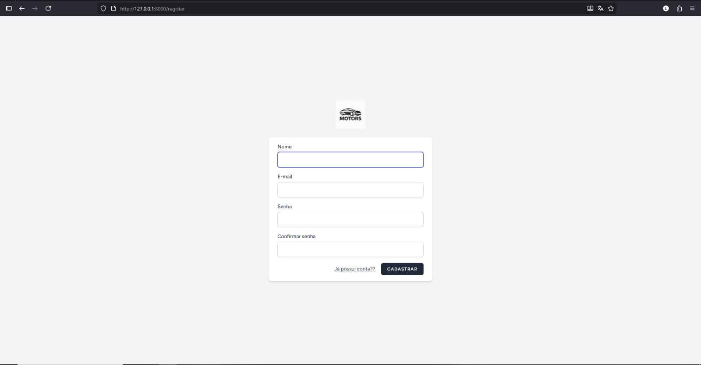

* Tela inicial de administrador
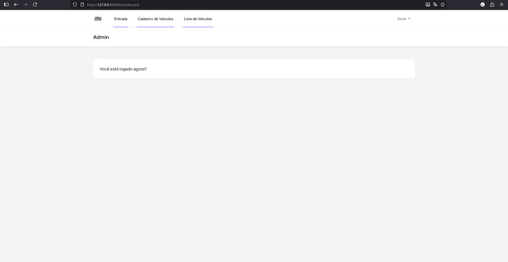

* Tela de cadastro de veiculo novo
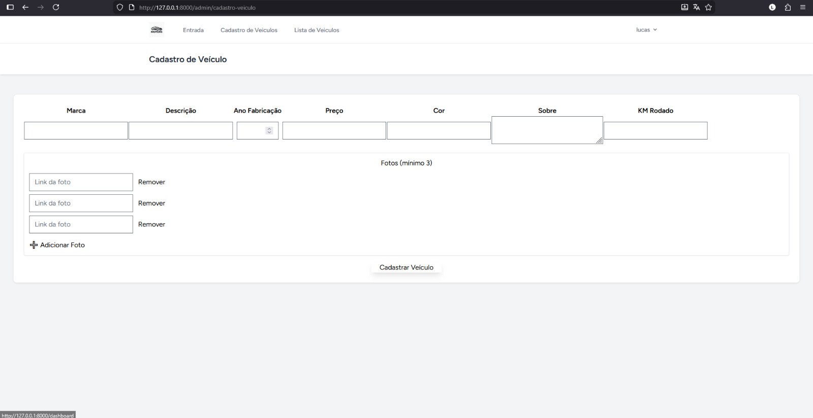

* Tela de Grid/lista de todos os veiculos cadastrados
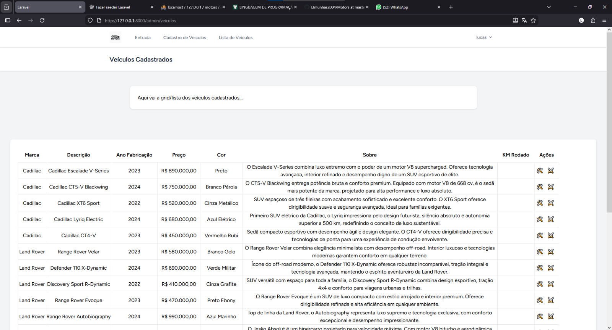

* Confirmação de exclusão de Veiculo

* Tela de Edição de veiculo cadastrado
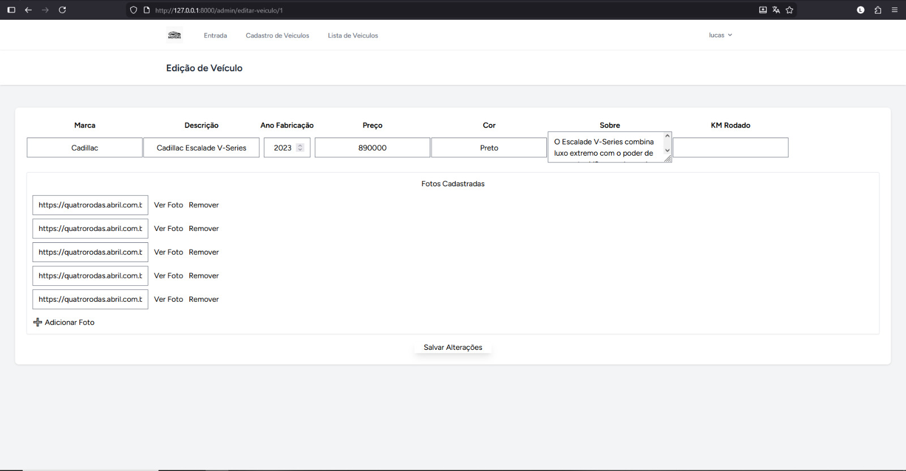

* Opções de Logoff e acesso da edição de perfil
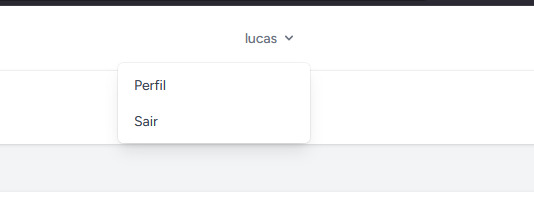

* Tela de Edição de perfil
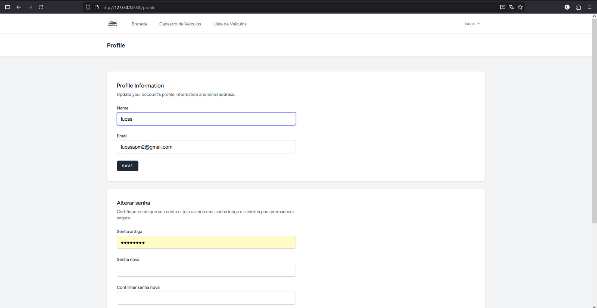
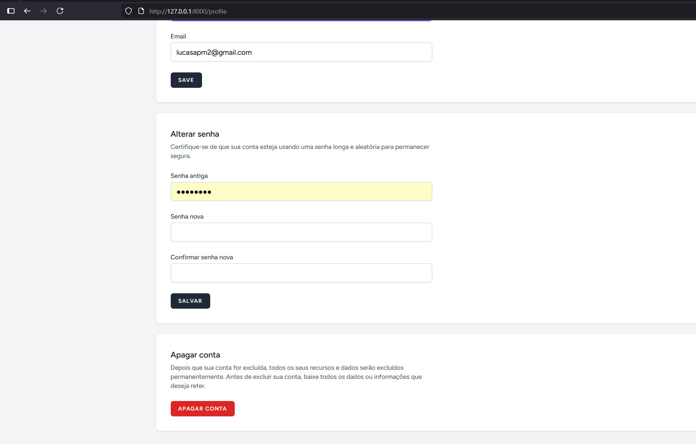

* E-mail de redefinição de senha chegando no usuario
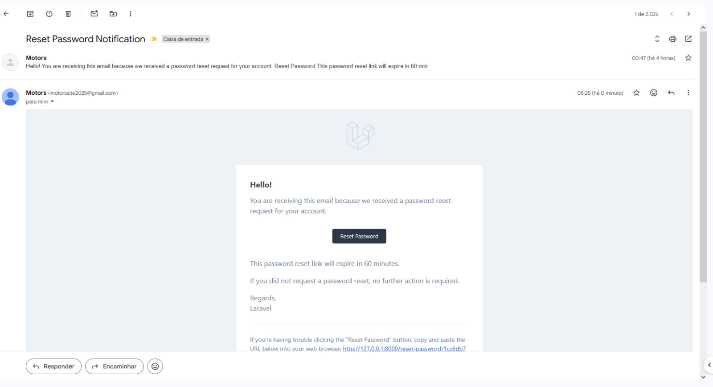

* Tela de redefinição de senha
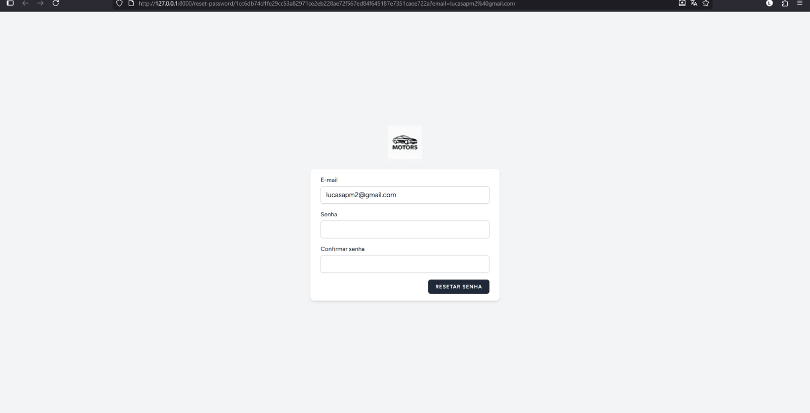

* Confirmação de que a senha foi redefinida
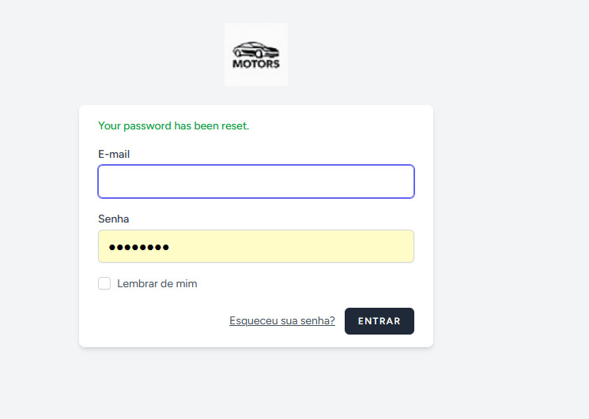

   
